# 🎓 SetLife-AI: Multi-Agent Academic Strategist

[](https://adhiraj0905-setlife-ai-main-ugstht.streamlit.app/)


**SetLife-AI** is an intelligent, multi-agent system designed to democratize high-end university admissions counseling. By orchestrating three specialized AI agents, the system analyzes unstructured student profiles, performs gap analysis against university requirements, and generates a hyper-personalized execution roadmap.

🔗 **[Live Demo](https://adhiraj0905-setlife-ai-main-ugstht.streamlit.app/)**

---

## 🧠 System Architecture

This project moves beyond simple "chatbots" by implementing a **Sequential Multi-Agent Pipeline**. Each agent has a specific role, distinct prompt engineering context, and structured JSON output enforcement.

```mermaid
graph TD
    User["User Inputs"] -->|Unstructured Text| Agent1["🕵️ Profile Agent"]
    Agent1 -->|Structured JSON| Agent2["🏫 University Agent"]
    
    Agent2 -->|University List| Agent3[" Action Plan Agent"]
    Agent3 -->|Gap Analysis & Roadmap| UI["Streamlit Dashboard"]
```




### The Agent Workflow:

1.  **🕵️ Profile Agent:**
      * **Role:** The Extractor.
      * **Task:** Ingests messy text (essays, grades, interests) and normalizes it into a strict JSON schema containing academic metrics, constraints (budget/location), and latent interests.
2.  **🏫 University Agent:**
      * **Role:** The Matchmaker.
      * **Task:** Cross-references the student profile against an internal university database. It categorizes schools into **Reach**, **Target**, and **Safe** tiers based on acceptance probability and budget alignment.
3.  **🧠 Action Plan Agent:**
      * **Role:** The Strategist.
      * **Task:** Performs a **Gap Analysis** between the current profile and the "Reach" schools. It generates a "Spike" project idea (to boost profile uniqueness) and a month-by-month execution timeline.

-----

## 🚀 Installation & Setup

Want to run this locally? Follow these steps:

1.  **Clone the repository**

    ```bash
    git clone [https://github.com/adhiraj0905/setlife-ai.git](https://github.com/adhiraj0905/setlife-ai.git)
    cd setlife-ai
    ```

2.  **Create a Virtual Environment**

    ```bash
    python -m venv venv
    # Windows
    venv\Scripts\activate
    # Mac/Linux
    source venv/bin/activate
    ```

3.  **Install Dependencies**

    ```bash
    pip install -r requirements.txt
    ```

4.  **Set up API Keys**

      * Create a `.env` file in the root directory.
      * Add your Google Gemini API key:
        ```
        GOOGLE_API_KEY="AIzaSy...your_key_here"
        ```

5.  **Run the App**

    ```bash
    streamlit run main.py
    ```

-----


## 🤝 Contributing

Contributions are welcome\! Please fork the repository and submit a pull request for any enhancements (e.g., adding more universities to the database or integrating a PDF resume parser).


```
